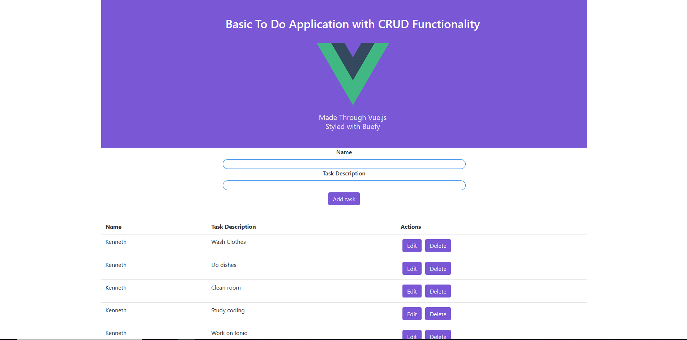
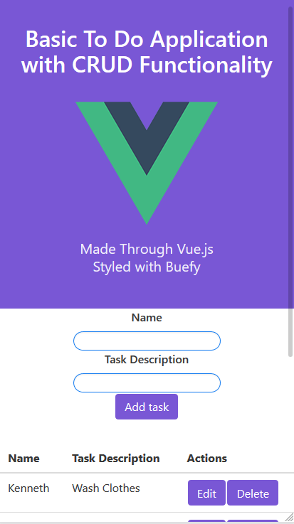

# Vue-To-Do

## Description
Basic To Do List Application with Crud Functionality utilizing a Rest API

Demo Link: https://vue-todo-kdu.netlify.com/ 

# Technologies Used
* Vue.js
* ES6
* Javascript
* Buefy
* Vue CLI
* Json-Server

# Screenshots

## Web
## 

## Mobile
## 

## Project setup
```
npm install
```

### Compiles and hot-reloads for development
```
npm run serve
```

### Compiles and minifies for production
```
npm run build
```

### Run your tests
```
npm run test
```

### Lints and fixes files
```
npm run lint
```

### Customize configuration
See [Configuration Reference](https://cli.vuejs.org/config/).

## *Support and contact details*
Contact: Kenneth Du, kennethdu3@gmail.com
